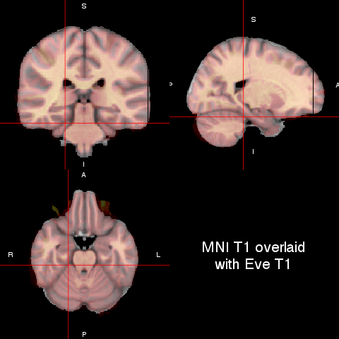

## Eve Atlas 
This repository contains the "Eve Atlas" from the Johns Hopkins University School of Medicine, Department of Radiology, Center for Brain Imaging Science.  It is based on a single-subject data as described in Oishi et al, 2009. There are co-registered T1 (MPRAGE), T2, with associated atlases and look up tables (LUT files).  The original format is `nrrd`, which was converted to `NIfTI` using [`Slicer`](http://slicer.org/).  All original images have 181x217x181 / 1x1x1 mm dimensions.

## Original Data
Eve atlas downloaded from Slicer [here](http://w.slicer.org/publications/item/view/1883).  

The direct download of the zip file is located at [http://w.slicer.org/publications/bitstream/download/4779](http://w.slicer.org/publications/bitstream/download/4779).  

## Clinical Toolbox
The 2 files `sct1_unsmooth.nii.gz` and `betsct1_unsmooth.nii.gz` correspond to the T1 and skull-stripped (with BET) T1 image from the [Clinical toolbox for SPM](http://www.nitrc.org/projects/clinicaltbx/) from Christopher Rorden as described in [doi: 10.1016/j.neuroimage.2012.03.020](http://dx.doi.org/10.1016/j.neuroimage.2012.03.020).  This is referred to as the Rorden template.

## Transformed Data

The Eve T1-weighted image was skull-stripped using [BET](http://fsl.fmrib.ox.ac.uk/fsl/fslwiki/BET).  This image was transformed into the space of Rorden template and MNI 152 [(6th generation)](http://www.bic.mni.mcgill.ca/ServicesAtlases/ICBM152NLin6) Template included with [FSL](http://fsl.fmrib.ox.ac.uk/fsl/fslwiki/Atlases).  

Two methods were used for transforming the data: Symmetric Normalization (SyN) [doi: 10.1016/j.media.2007.06.004](http://dx.doi.org/10.1016/j.media.2007.06.004) using the Advanced Normalization Tools (ANTs) and the associated R package [ANTsR](http://stnava.github.io/ANTsR/) and Deformable Registration via Attribute Matching and Mutual-Saliency Weighting (DRAMMS) [doi: 10.1016/j.media.2010.07.002](http://dx.doi.org/10.1016/j.media.2010.07.002).  

The estimated transformation was used to warp the atlases to the associated space and a nearest-neighbor interpolation was used to create labels.

## Reason for Use
### Comparison of Eve to MNI image
The Eve atlas has been used previously to describe anatomical locations of the brain.  One problem is that the Eve atlas and the MNI 152 from FSL (and other MNI data) are not necessarily located in the same space.  See [Dr. Mori's discussion of this issue with the dimensions](http://lists.mristudio.org/pipermail/mristudio-users/2009/000709.html): 

> Hello,
> 
>  
> 
> The ICBM-152 Atlas that comes from the UCLA web site has dimensions of 182 x
> 218 x 182 .  Within DTI Studio it is 181 x 217 x 181.  There seems to be a
> single slice  difference between both templates?  Where would the single
> slice need to be added for both templates to match?
> 
>  
> 
> Regards,
> 
> Arun

and the response 

> Hi Arun,
>
> 
> 
> It is likely that the difference is just 0 padding at the 182th, 218th, and
> 182th line. You can convert our 181x217x181 atlas to 182x218x182 using the
> "Crop" function in Landmarker. Another possibility is that it was
> interpolated, which can also be done by Landmarker. You may want to make
> sure by subtracting the images (you can do it in RoiEditor). 
> 
>  
> 
> We also got ICBM-152 from UCLA and don't know why there are two versions
> with different dimensions. 
> 
>  
> 
> Susumu
> 

Now as you can see in  that they agree relatively well if you drop the `x=182`, `y=218`, and `z=182` slices of the MNI template (or similarly zero pad the Eve template/atlas).  For those who cannot manipulate images easily (such as dropping slices), this is a problem.  

### Solutions for use with the MNI Template
The possible solutions are as follows:

1.  Use `JHU_MNI_SS_T1_brain_182x218x182.nii.gz`, which has zeros padded to the last dimension of the image
2.  Use `MNI152_T1_1mm_brain_181x217x181.nii.gz`, which has the last slice of each dimension removed
3.  

### Comparison of Eve to Rorden T1 image
So 
